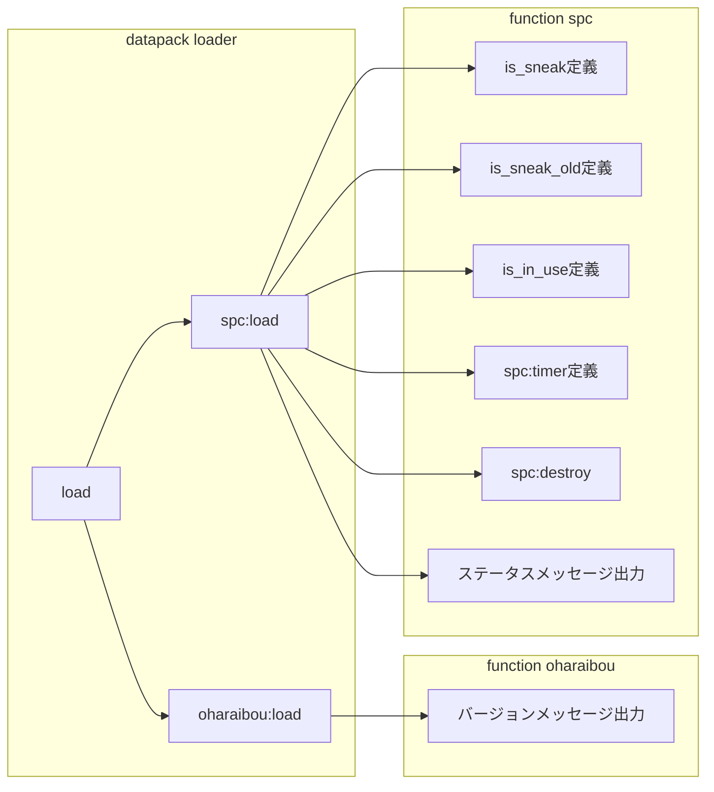
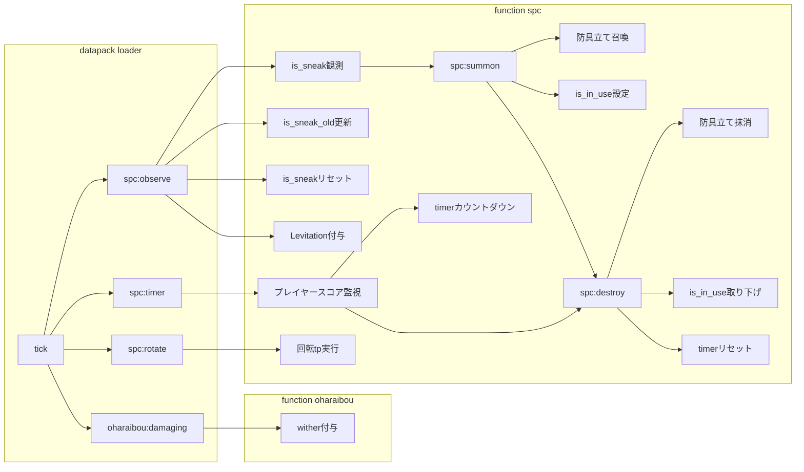

# お祓い棒パック
- [お祓い棒パック](#お祓い棒パック)
	- [概要](#概要)
		- [内容](#内容)
		- [効果](#効果)
		- [開発状況](#開発状況)
	- [導入と削除](#導入と削除)
		- [導入](#導入)
		- [削除](#削除)
	- [既知の不具合](#既知の不具合)
	- [フローチャート](#フローチャート)
		- [load実行](#load実行)
		- [tick実行](#tick実行)
	- [謝辞](#謝辞)

## 概要
### 内容
Minecraftにお祓い棒的なものを追加します \
~~なんてことはない、ただの鉄の鍬にちょっと改造を加えたようなものですが。。。~~

### 効果
手に持ってゾンビに近づくとダメージを与えます \
手に持ってスニークすると周囲のモブを空中に打ち上げます

ところどころにバグがあります -> [既知の不具合](#既知の不具合) \
未知のバグや機能追加などの要望などはissueなりX(Twitter)のDMへどうぞ

### 開発状況
更新停止中 \
内部名称```spc```は変更される可能性がります。\
製作者の気まぐれか、要望があった場合だけ更新します

## 導入と削除

### 導入
**動作確認済み環境**
最新版には対応していません。
- Minecraft Java Edition 1.16.5 ~ 1.18.2

リリースからzipをダウンロードし、任意のワールドのdatapacksに移動\
ワールドを開き、

```
/reload
/datapack enable "file/oharaibou_pack_[バージョン].zip"
```

```読み込み完了```と表示されたら読み込み完了

```
/function oharaibou:give
```

でお祓い棒(?)を入手

コマンド候補が出ない場合、チートをオンにしてください。

### 削除
ワールドのdatapacksからzipを削除


## 既知の不具合
マルチプレイは現在テスト中です。
- Shiftを連打すると内部タイマーが正常にセットされないようです。
  - 効果はMinecraftのtpsに依存しますので穏やかに使ってあげてください。

## フローチャート
### load実行



### tick実行


## 謝辞
- かゆ ([@kayusannn](https://x.com/kayusannn))さん

マルチプレイ時のデバッグやスクショ撮影などお手伝い頂き、ありがとうございます。\
得られた成果・画像等、内容は後日更新予定です。